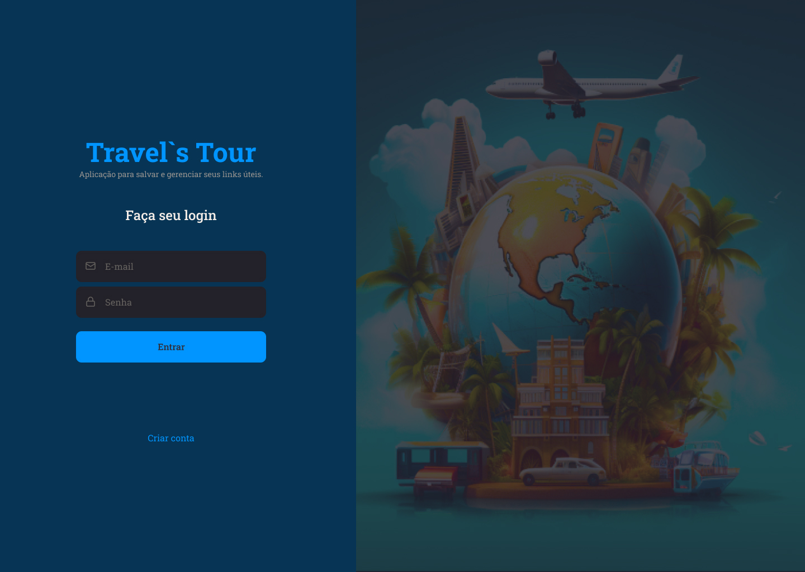

<h1 align="center"> Travels Tour </h1>

Front-end desenvolvido para agendamentos de notas com passeios durante sua viagem  

  <a href="#-tecnologias">Tecnologias</a>&nbsp;&nbsp;&nbsp;|&nbsp;&nbsp;&nbsp;
  <a href="#-projeto">Projeto</a>&nbsp;&nbsp;&nbsp;|&nbsp;&nbsp;&nbsp;
  <a href="#-layout">Layout</a>&nbsp;&nbsp;&nbsp;|&nbsp;&nbsp;&nbsp;
  <a href="#memo-licença">Licença</a>

  

 

  

## 🚀 Tecnologias

Esse projeto foi desenvolvido com as seguintes tecnologias:

- HTML e CSS
- JavaScript
- Node
- React
- Axios
- Figma
- Git e Github

## 💻 Projeto

  O projeto TravelsTour foi desenvolvido durante aula do curso Explorer Stage 09 e 10! Com foco no aprendizado de conexões do Backend e FrontEnd
    
  Nele o usuário consegue adicionar a atividade e horário específicos e marcar suas atividades como feitas, assim que concluidas!

# React + Vite

This template provides a minimal setup to get React working in Vite with HMR and some ESLint rules.

Currently, two official plugins are available:

- [@vitejs/plugin-react](https://github.com/vitejs/vite-plugin-react/blob/main/packages/plugin-react/README.md) uses [Babel](https://babeljs.io/) for Fast Refresh
- [@vitejs/plugin-react-swc](https://github.com/vitejs/vite-plugin-react-swc) uses [SWC](https://swc.rs/) for Fast Refresh

## :memo: Licença

Esse projeto está sob a licença MIT.

---

Feito com ♥ by Rocketseat e Rafael Ehlke

